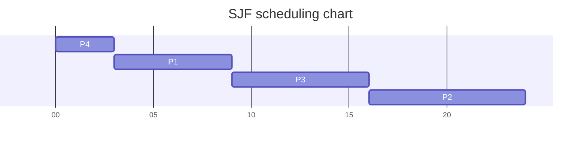
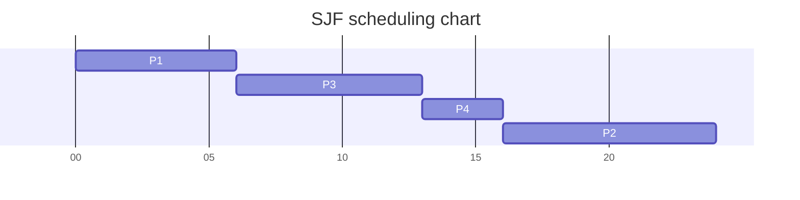
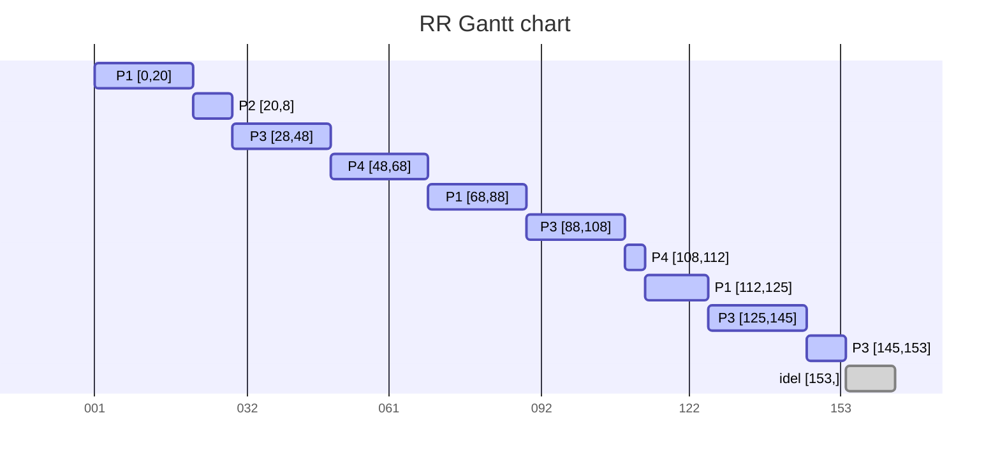

[toc]
## Overview

**CPU调度** (`cpu scheduling `)，是决定在一个时间窗口内，哪个进程可以拥有CPU而另外一个个进程会被暂停的过程。CPU调度的作用是为了确保每当CPU空闲时，操作系统至少选择就绪队列中一个可用的进程执行。这个选择过程将由CPU调度器来执行。

调度程序：挑选就绪进程的内核函数

- 调度策略：依据什么挑选进程？
- 调度时机：什么时间进行调度？
  - 进程从运行状态切换到等待状态
  - 进程退出
  - 非抢占式：当前进程主从放弃CPU时，
  - 抢占式：当前进程被抢占
    - 时间片用完
    - 进程从等待切换到就绪（当前就绪进程优先级高于当前运行进程）

## 调度准则

### CPU的调度策略

#### 抢占式调度

抢占式调度（`Preemptive`）在分配进程时有对应的优先级。而在另一个较低优先级进程之前运行具有较高优先级的进程很重要，即使较低优先级的进程仍在运行。较低优先级的进程扔会等待一段时间，让较高优先级的进程完成执行后恢复。

抢占式调度主要发生在运行状态切换到就绪或等待状态

#### 非抢占式调度

非抢占式调度 （`Non-Preemptive`），在这种类型的调度中，一旦将资源（CPU 周期）分配给一个进程，该进程就会持有CPU使用权，直到它被终止或达到等待状态。

抢占式调度主要发生在运行状态终止的情况下

#### 如何确定调度是抢占式还是非抢占式？

一般来讲，确定调度的方式是通过以下四点来确定的：

- 当进程从运行状态切换到等待状态；如I/O请求或调用 wait() 系统调用
- 当进程从运行状态切换到就绪状态；如响应中断。
- 当进程从等待状态切换到就绪状态；如在 I/O 完成或从 wait() 返回时。
- 进程完成执行并终止；

如果调度发生在1 4情况下，则为非抢占式，否则为抢占式

### 程序执行模型

需要关注的是进程在计算机系统中运行时存在什么状态？

几乎所有进程都在一个连续的循环的两种模型之间交替：即**CPU突发**和**I/O突发**中交替

- 每个调度决定都是关于在下一个CPU突发时将哪个工作交给CPU
- 在时间分片机制下，线程可能在结束当前CPU突发前被迫放弃CPU

CPU突发和 I/O突发的交替序列逻辑

CPU 突发型的持续时间

### 调度指标

在了解评价指标前，需要对CPU调度中的一些术语需要了解

- **CPU突发** （`Burst Time` BT）：进程开始执行的时间，从到达到开始执行花费的时间
- **到达时间** （`Arrival Time` AT）：进程到达就绪队列的时间
- **完成时间**（`End Time` ET 或 `Completion Time` CT）：进程执行完成的时间
- **等待时间** （`Waiting Time` WT）：进程在就绪队列中等待轮到 CPU 占用的时间；$WT = TT - BT$
- **周转时间** （`Turnaround Time` TT）：完成时间和到达时间的差  $TT=CT-AT$
- **相应时间**（`Response Time` RT）：开始响应请求所需的时间。第一次请求到相应的时间。
- **吞吐量** (`Throughput`)：单位时间内完成的进程数。$Throughput = (Number\ of\ processes\  completed) \div (Time\ unit)$

一般情况下，需要的服务”越快“越好，而快的定义：

- 传输文件的高带宽（相应时间）
- 玩游戏的低延迟（吞吐量）
- 上述两个因素是互相独立的

需要对低延迟和高带宽做一个平衡

### 比较算法的准则

- 相应时间目标：通过低延迟的调度改善用户的交互体验
  - 减少相应的时间：及时处理用户的输出并且尽快将输出提供给用户
  - 减少平均相应时间的波动：在交互式系统中，可预测性比高差异低平均更重要
  - 相应时间是操作系统的计算延迟
- 吞吐量目标：操作系统应该保证吞吐量不受用户交互的影响
  - 增加吞吐量，增加系统吞吐量大概可以从两个角度来提出
    - 减少开销（上下文切换）
    - 系统资源的高效利用（CPU，I/O）
  - 减少等待时间
  - 吞吐量是操作系统的计算带宽

### 公平的目标

在整个操作系统进程管理中的调度挑战在于如何使整个系统尽可能地“高效”与“公平”（`efficient`" and `fair`），这受制于不断变化且通常是在动态的条件下，而“高效”和“公平”在某种程度上是主观的，经常会受到不断变化的抢先策略而被影响。

而公平的定义是可以让每个进程等待相同的时间，如：

- 保证每个进程占用相同CPU的时间
- 如果一个用户比其他用户运行更多的进程的情况下该如何处理？

而保证公平带来的则通常会增加平均的相应时间

## 调度算法

### 基本调度算法

#### 先到先服务

先来先服务 (`First Come First Serve` FCFS)，是最简单的调度算法，FCFS是根据进程的到达时间进行调度；即表示，先请求 CPU 的进程先分配CPU。它是通过使用`FIFO`  队列来实现的。当一个进程进入就绪队列时，该进程的 PCB 会被放置到队列的尾部。当CPU空闲时，会将队列头部。然后从队列中删除正在运行的进程。FCFS 是一种非抢占式调度算法。

实例：假设有三个进程按以下顺序到达：P1 , P2, P3；CPU突发时间为 24 3 3

| Process | Burst Time |
| ------- | ---------- |
| P1      | 24         |
| P2      | 3          |
| P3      | 3          |

那么对应的甘特图是：

那么衡量指标的信息如：

- 等待时间WT为：P1=0；P2=24；P3=27
- 平均相应AT时间为:  $(0 + 24 + 27)\div3 = 17$

这里存在一个问题，如果第一个进程执行时间过长，会导致后面所有的进程等待时间过长，这样会拖长整个队列的平均相应时间。这种现象被称为**护航效应** （`Convoy Effect`）。

护航效应，在调度算法中当CPU密集型（`CPU-bound`）进程在 I/O密集型（` I/O-bound`）进程之前到达系统时，即使 I/O密集型进程需要较少的CPU时间，此时CPU密集型进程也会根据FCFS的策略而获得CPU时间。

护航效应类比图

为了更有效的避免护航效应，可以使用抢占式的调度算法，如RR；抢占式调度算法可以使每个进程都有相同的机会使用CPU。而这些较小的进程占用很短的CPU时间，而不必等待很长的CPU时间，从而加快执行速度并减少闲置资源。

例如假设执行顺序按照：P2 , P3, P1，那么整个的执行队列如下图

此时平局等待时间WT为： P1 = 6;P2 = 0; P3 = 3

平均等待时间为：$(6 + 0 + 3)\div3 = 3$

缺点:

- 平均等待时间波动较大
- 花费时间少的任务可能排在花费时间长的任务后面
- 可能导致IO和CPU之间的重叠处理(CPU密集型进程会导致IO设备闲置时，IO密集型进程也在等待)

#### 最短作业优先

最短作业优先 （`Shortest Job First` SJF），是一种非抢占式的调度算法，SJF会首先调度具有最短CPU Brust的进程。如果两个进程具有相同的BT，则使用FCFS来打破平局。其特点为：

- 对每个进程关联其下一个CPU Brust的大小，使用这些长度来排序以最短会被优先调度
- SJF最大的优势是，给定一组进程的最短平均等待时间 AT
- SJF难度在于如何知道下一个 CPU请求的长度

如：假设有三个进程按以下顺序到达：P1 , P2, P3，P4；CPU突发时间为 6 8 7 3，将其排好序后如图

| Process | Burst Time |
| ------- | ---------- |
| P1      | 6          |
| P2      | 8          |
| P3      | 7          |
| P4      | 3          |

此时平均相应时间为 $(P_{1}+P_2+P_3+P_4)\div4$ = $(3 + 16 + 9 + 0) \div 4 = 7$ 。

此时如果将某一个进程的顺序作为调整，如：P4 调整到 P3之后，会减少对应的平均相应时间吗？对应的gantt如下：

此时平均相应时间为 ：（Pi 为进程的运行时间，Ri 为进程的TT）

- $((P_1-R_4)+(P_3-R_4)+2(P_1+P_3-2\times P_4)+P_2)\div4$
- $((6-3)+(7-3)+2(6+7 - 2\times3)+8) \div 4 = 7.25$

**SJF存在的问题**：

- 饥饿 ；饥饿（`starvation`）又被称为无限阻塞（`indefinite blocking`）,
  - 连续的短任务流会使场任务饥饿
  - 短任务可用时的任何长任务的CPU时间都会增加增加整个队列的平均等待时间

- 需要预知进程的执行时间
  - 怎么预估下一个CPU突发的持续时间
    - 简单的解决：询问用户
  - 如果用户欺骗就杀死进程
  - 如果不知道怎么办?

**如何确定下一个进程的CPU Brust**

只能通过预估的方式确定进程的执行长度，可以通过使用历史的CPU Brust的长度，使用其平均指数来预估，这里就有几个参数：

- $t_n$：第N点的CPU Brust的实际值
- $\tau_{n}$：第N点的CPU Brust的预估值，。
- $\alpha$：是一个因子，控制整个历史相对的权重，$0 \leq \alpha \leq 1$，通常情况下 $\alpha$ 设置为 ${1 \over 2}$
  - $\alpha = 0$，则 $\tau^{n+1} = \tau^n$，初始预估值永远没有变化
  - $\alpha = 1$，则 $\tau^{n+1} = \tau^n$，初始预估值始终根据第几个进程的实际值的变化而变化
  - 当$\alpha = {1 \over 2}$，则历史和最近的权重相同
- **Τ0**：是一个常数或整个系统的平均值。

得到一个公式：

- $\tau_{n} = \alpha t_n+(1-\alpha)\tau_{n}$

- $\tau_{n+1} = \alpha t_n+(1-\alpha)\tau_{n-1} + (1-\alpha)^2\tau_{n-2}....(1-\alpha)^j\tau_{n+1}$

> **实例题：$\tau_1=10$，$\alpha=5$，之前执行的队列为8,7,4,16，接下来预估值是多少？**
>
> A. 9		B. 8		C. 7.5		D. None
>
> 解析：因为是SJF算法，及历史执行的序列为 [4, 7, 8, 16]，并且已知 $\tau_1=10$ $t_1=4$ $\alpha=0.5$
>
> $\tau_2 =  \alpha \times t_{n-1} +(1-\alpha)\tau_{n-1}$ = $0.5\times4+0.5\times 10=7$ 	 因为$t_1=4$，$\tau_1=10$
>
> $\tau_3 =  \alpha \times t_{n-1} +(1-\alpha)\tau_{n-1}$ = $0.5\times7+0.5\times 7=7$		因为$t_2=7$，$\tau_2=7$
>
> $\tau_4 =  \alpha \times t_{n-1} +(1-\alpha)\tau_{n-1}$ = $0.5\times 8+0.5\times 7=7.5$	因为$t_3=8$，$\tau_3=7$

> Reference
>
> [handout scheduling](http://www.cs.cornell.edu/courses/cs4410/2017sp/schedule/slides/08.scheduling.pdf)
>
> [SJF Quiz](https://testbook.com/objective-questions/mcq-on-shortest-job-first--5eea6a1539140f30f369f363)

#### 最高响应比优先

**HRRN**（Highest Response Ratio Next）调度算法是操作系统中的一种非抢占式调度算法。HRRN是对**SJF**的改进版，从而减少饥饿问题。

HRRN的特点：

- 非抢占式
- 对进程增加了关注点：进程等待了多长时间
- 防止饥饿问题（无限期延后）

$RR  = (W+S)\div S$

**RR**：响应比，**Response Ratio**

**W**：表示等待时间。

**S**：表示服务的时间，即Burst Time或执行时间。

HRRN是综合考虑了执行时间和等待时间，如：假设有三个进程按以下顺序到达：P1 , P2, P3，P4；CPU突发时间为 6 8 7 3，将其排好序后如图

| Process | Burst Time | Arrival Time |
| ------- | ---------- | ------------ |
| P1      | 3          | 1            |
| P2      | 6          | 3            |
| P3      | 8          | 5            |
| P4      | 4          | 7            |
| P5      | 5          | 8            |

- time=0 时，就绪队列为空，0 到 1 为是 CPU 空闲时间。
- 在 time=1 时，就绪队列仅有P1。因此，进程 P1 一直执行直到完成。
- 在进程P1之后，在 time=4 时只有进程 P2 到达，故进程 P2 被执行。
- 在 time=10 时，进程 P3、P4 和 P5 已全达到就绪队列中。故P2之后，需要计算响应率。
- P3 $RR=(10-5+8)/8 = 1.625$
- P4 $RR=(10-7+4)/4 = 1.75$
- P5 $RR=(10-8+5)/5 = 1.4$

此时P4响应率最高，故P4先执行，执行后需要计算P3和P5的顺序：

- P3 $RR=(14-5+8)/8 = 2.125$
- P5 $RR=(14-8+5)/5 = 2.2$

此时整个队列中的执行周转时间和等待时间如下表：

- $TT=ET-AT$
- $WT=TT-BT$

| Process | AT   | BT   | ET   | TT   | WT   |
| ------- | ---- | ---- | ---- | ---- | ---- |
| P1      | 1    | 3    | 4    | 3    | 0    |
| P2      | 3    | 6    | 10   | 7    | 1    |
| P3      | 5    | 8    | 27   | 22   | 14   |
| P4      | 7    | 4    | 14   | 7    | 3    |
| P5      | 8    | 5    | 19   | 11   | 6    |

这个队列的执行甘特图就如下：

平均等待时间：$AWT=(0+1+14+3+6)\div5 = 24\div5=4.8$

##### HRRN的特点

**优点**：

- HRRN教SJF有更好的性能。
- HRRN可以减少较长进程的等待时间，同时也鼓励较短的作业。
- 增加了吞吐量，避免了饥饿现象

**缺点**：

- HRRN处于理想状态，因为无法提前预知每个进程的BT。
- HRRN会增加CPU的开销。

#### 轮训

轮训调度算法`Round-Robin` RR，是最简单的调度算法，即每个进程获得相同的CPU时间量子（`quantum`）并轮流执行

如：假设有三个进程按以下顺序到达：P1 , P2, P3，P4；CPU突发时间为 53  8 68 24，时间片为20

| Process | BT   |
| ------- | ---- |
| P1      | 53   |
| P2      | 8    |
| P3      | 68   |
| P4      | 24   |

这四个进程轮流占用CPU，那么执行的甘特图如下：

等待时间 WT：

- $P_1 = (68-20)+(112-88)=72$
- $P_2=20-0=20$
- $P_3=(28-0)+(88-48)+(125-108)=85$
- $P_4=(48-0)+(108-68)=88$

平均等待时间 AWT：

- $AWT=(72+20+85+88)\div4=66.25$

##### 性能

- q 较大时，类似于FIFO
- q较小时，上下文切换此时很多，所以q需要设置的较大些
- 通常情况下，平均周转率要优于SJF，也不会出现饥饿状态

##### RR的特点

**优点**：

- 避免了饥饿或护航现象
- 所有进程获得量子都是公平的
- 没有优先级
- 不依赖Brust time

**缺点**：

- 花费更多的时间在上下文切换上
- 性能取决于量子的大小
- 不能设置优先级
- 如何设置一个平均大小的量子非常困难

#### 多级反馈队列

多级反馈队列（`Multilevel Feedback Queue`）是指，当进程进入系统时被永久分配给相应队列。进程不会在队列之间移动。

- 就绪队列被划分为不同的队列：

  - 前台（交互式 `interactive`）

  - 后台（批处理 `batch`）

- 每个队列是对应的调度算法：
  - 前台 – RR
  - 后台 - FCFS
- 调度必须在队列之间进行：
  - 固定的调度优先级：如：先前台，再后台
  - 会存在饥饿现象
- 时间分片：
  - 每个队列获得一定的时间分片，并在进程间调度
  - 如 RR - 80%前台，FCFS - 20%后台 

多级反馈队列通过历史来预测未来，克服了SJF的预测问题；如果进程过去是I/O密集型的，那么未来也可能发生I/O密集型。通过利用这种行为，调度器可以选择使用最少CPU的进程进行调度。

- 拥有不同优先级的队列，如RR
  - 一次结束后，将在下一个高优先级的队列进行作业
  - 循环的时间片随着优先级的降低而增长

**优先级的调整**：

- 进程开始在最高优先级队列中执行
- 当时间片结束，降低优先级
- 当时间片没结束（发生CPU上下文切换是I/O事件）则提高优先级，直到最高优先级队列
- CPU密集型的优先级下降，I/O密集型的优先级上升

#### 公平共享调度

公平共享调度 `Fair-share scheduling`，是将处理器的时间平均分配给用户，在用户级别公平分享CPU；如有5个用户同时执行一个进程，调度器会将同等份额的 CPU 周期，分配给每个用户，即每个用户20% 

- 一些用户组比其他用户组更重要
- 保证不重要的组无法垄断资源
- 未使用的资源按照每个组所分配的资源的比例来分配
- 没有达到资源使用率目标的组获得更高的优先级

### 实时调度

实时操作系统 **RTS**，正确性依赖于其时间和功能两方面的一个操作系统；RTS调度算法主要目标是关注满足任务期限，而不是对任务吞吐量、延迟和响应时间等指标。

举个例子：喂养不同种类的动物，如马和奶牛。

- 马，每20分钟喂养一次，一次需要10分钟
- 奶牛，每50分钟喂养一次，每次25分钟

- 如果使用rr，第一次喂马10分钟，第二次喂牛25分钟，第三次喂马，此时喂养时间不够，马死了
- 使用固定时间片喂养的话，喂马10分钟，喂牛10分钟，牛喂养时间不足，牛死了
- EDF：截止日期最早优先
  - 喂马10分钟
  - 喂牛10分钟
  - 到达第三次，需要又需要喂马，10分钟
  - 第四次，喂牛15分钟，此时时间为45，满足牛和马的喂养时间，使用EDF，可以保障到牛和马都不会死

- 性能指标：
  - 时间约束的及时性 **deadline**
  - 速度和平均性能相对不重要
- 主要特征：时间约束的可预测性

#### RTS分类:

- 硬实时系统 **Hard RTS**：需要在保证时间内完成重要的任务；必须完成，错过最后期限deadline，将对整个系统产生灾难性的故障。
- 软实时系统 **Soft RTS**: 要求重要的进程的优先级更高，尽量完成，并非必须

#### RTS相关时间参数

- $a_j$ ：**Arrival Time**，工作准备好执行的时间。
- $C_j$：**Computation (execution) time**，任务在处理器不中断的情况下执行所需要的时间
- $d_j$：**Absolute deadline**，绝对截止时间，工作应该完成的时间
- $D_j$：**Relative deadline**，到达时间和绝对截止时间之间的长度
- $S_j$：**Start Time**，进程开始执行的时间
- $f_j$：**Finishing Time**，进程完成执行的时间
- $R_j$：**Response time**，作业到达后执行时间的长度，$R_j=f_j-a_j$

#### 实时系统要求

- 决定任务执行的顺序
- 静态优先级调度
- 动态优先级调度

### EDF

**Earliest Deadline First (EDF)**，截止日期最早优先，EDF使用进程的优先级进行调度。它根据绝对终止期限为进程分配优先级。截止日期最近的任务获得最高优先级。

有五个进程，如表：

| Process | $a_j$ | $C_j$ | $d_j$ |
| ------- | ----- | ----- | ----- |
| J1      | 0     | 5     | 6     |
| J2      | 2     | 2     | 8     |
| J3      | 8     | 6     | 20    |
| J4      | 10    | 3     | 14    |
| J5      | 15    | 4     | 22    |

那么其执行甘特图如下

**EDF特点**：

- 最佳的动态优先级调度算法
- deadline越早优先级越高
- 先执行deadline最早的任务

#### RM

速率单调 `Rate-Monotonic` 算法是指，周期较小的任务具有较高的优先级。（$C_i, T_i, D_i$） 

$T_i$ ：周期任务

- t1 = (1, 6, 6), 
- t2 =  (2, 8, 8), 
- t3 = (4, 12, 12)

**RM特点**：

- 提前进行优先级排序
- 适合静态优先调度
- 周期越短，优先级越高
- 先执行周期最短的任务

> Reference
>
> [Real-Time Scheduling](https://cps.cse.uconn.edu/wp-content/uploads/sites/2687/2019/10/ch6.2.pdf)

## 多处理器调度

多处理器调度，即存在**多个 CPU**可用，然而，与单处理器调度相比，多处理器调度更**复杂。**

### 多处理器调度方法

- 非对称多处理，**Asymmetric multiprocessing** AMP
  - 一个系统只允许一个CPU执行代码，如一个处理器处理用户代码，其他处理器处理I/O
- 对称多处理，**Symmetrical Multi-Processing** SMP，
  - 每个处理器是自调度的，即单独的就绪队列或者公共就绪队列，通过调度器分配要执行的程序

### 亲和度

亲和度 **Affinity** 是指，进程在一个处理器上运行时，当发生转移时，需要释放对应的缓存，在新处理器上在加载，此时增加了系统的相应速度，通常情况下，SMP会视图避免进程从一个处理器迁移至另一个处理器上。

- 软亲和度，**Soft Affinity**，是调度器尽可能长时间地将进程保持在同一个 CPU 上。这只是一种尝试；如果不可行，则将进程迁移到另一个处理器
- 硬亲和度，**hard affinity**，硬亲和度是利用系统调用 (`system call`)，强行将进程绑定到指定的CPU上

### 负载均衡

负载均衡是为了使多个CPU尽可能均衡的处理任务，即出现在SMP的现象，负载均衡可以保持所有处理器之间的工作负载平衡，以充分利用多个处理器的；否则就出现一个或多个处理器将处于空闲状态，而其他处理器具有高工作负载状态。

**负载均衡的通用方法**：

- 推送迁移：是指操作系统定期检查每个处理器上的负载。如果存在不平衡，一些进程将从一个处理器移动到另一个处理器。
- 拉取迁移：调度器发现一个处理器的运行队列中没有更多进程时。会从繁忙的处理器中拉出等待的任务

> Reference
>
> [Load Balancing](http://boron.physics.metu.edu.tr/ozdogan/OperatingSystems/ceng328/node130.html)
>
> [cpu affinity](https://www.how-hard-can-it.be/cpu-affinity-introduction/)
>
> [multiple-processor-scheduling](https://www.geeksforgeeks.org/multiple-processor-scheduling-in-operating-system/)
>
> [what are the types of process affinity](https://quick-adviser.com/what-are-the-types-of-process-affinity/#What_is_the_difference_between_soft_affinity_and_hard_affinity)

## 优先级反转

由于低优先级任务的干扰而导致的任务执行延迟称为优先级反转 **priority inversion**，优先级反转是1997年火星拓荒者着陆的一个问题。

如图所示：高优先级任务与低优先级任务共享资源时。当低优先级任务锁定资源时，高优先级任务必须等待，即使高优先级任务有资格运行。

如图所示，LP任务使用对共享资源加锁，t2时间HP发生抢占，此时因为LP没有对锁释放，HP处于阻塞状态，而MP发生抢占直到t5结束，此时CPU回到LP任务，直到t6结束，释放锁，此时HP才开始执行，即使HP处于高优先级也不会被执行。

解决的方法：

- 优先级继承 **Priority Inheritance**
  - 低优先级任务持有高优先级请求的资源，则低优先级任务将提高到与高优先级任务相同的优先级
    - 
    - 
    - 如图所示：具有不同优先级的三个任务共享一个资源。LP首先在时间 t1 获取资源。在t2，MP抢占 LP到 t3，当MP它需要资源时。MP被阻止。此时，LP 提升优先级同MP并恢复执行。HP在 t4抢占 LP 任务。当 HP 访问共享资源时，在 t5 被阻止。此时LP 从 HP 继承其优先级并恢复执行。一旦 LP 完成，它的优先级立即降低到最初分配的级别。
- 优先级天花板 **Priority ceiling** 
  - 优先级天花板中，每个任务的优先级都是已知的。每个任务所需的资源在执行之前也是已知的。任何时候正在运行的任务的当前优先级上限是当时正在使用的所有资源的最高优先级上限。
  - 

> Reference
>
> [ Priority Inversion](http://www.embeddedlinux.org.cn/rtconforembsys/5107final/LiB0101.html)