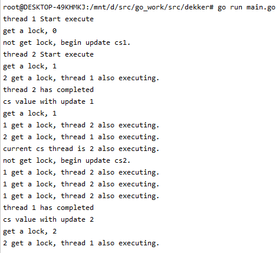
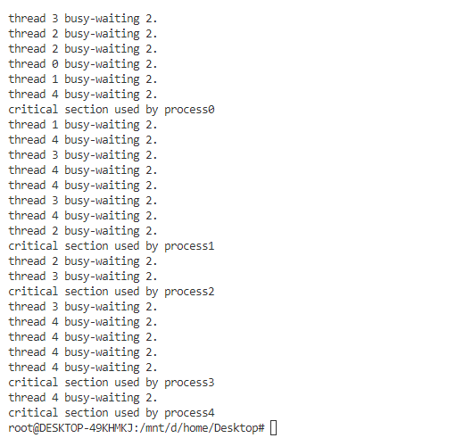

[toc]

## Background

多进程作为现代操作系统的重要特性，交互则会引起同时对共享资源的访问，当这些资源访问不正确会出现冲突或产生不适当的输出（冲突、死锁、饥饿）；而在同步的基础上，进程被分为以下两种类型：

- 独立进程 **Independent Process**
  - 不和其他进程共享资源或状态
  - 确定性，输入状态确定结果
  - 可重现，能够重现起始条件，I/O
  - 调度的顺序不重要
- 协作进程 **Cooperative Process**；
  - 多进程共享资源或状态
  - 不确定性 `probabilistic`
  - 不可重现

不确定性和不可重现意味着bug可能是间歇性发生的

### Cooperation

进程的互相影响，即进程间的合作（相互或破坏）；最简单的例子就是两个进程使用同一个文件，一个进程读，一个进程写。读进程的结果会被写进程所影响。

进程需要合作的原因：

- 资源共享：多个进程访问相同的数据
  - 一台电脑，多个用户
  - 一个银行存款余额,多台ATM机
  - 嵌入式系统（机器人手臂和收的协调）
- 计算加速：
  - I/O 和 CPU计算可重叠
  - 多处理器 - 将任务分解为子任务并分布在不同的进程中，它通常可以更快地运行（也需要多个可共享的 CPU）
- 模块化：复杂的任务组织成单独的子任务，让不同的进程运行
  - 大程序分成小程序
  - 是系统易于扩展


程序可以调用函数fork()来创建一个新的进程

- 操作系统需要分配一个新的并且唯一的进程ID
- 因此在内核中,这个系统调用会运行 `new_pid = next_pid++`;
- 翻译成机器指令:
  - `Load next_pid Reg1`
  - `STORE Reg1 new_pid`
  - `INC Reg1`
  - `STORE Reg1 next_pid`

假设两个进程并发执行

- 如果next_pid等于100, 那么其中一个进程得到的ID应该是100, 另一个进程的ID应该是101, next_pid应该增加到102
- 可能在INC前进行了上下文切换, 最终导致两个进程的pid都是100,而next_pid也是101

无论多个线程的指令序列怎样交替执行,程序都必须正常工作

- 多线程程序具有不确定性和不可重现的特点
- 不经过专门设计,调试难度很高

不确定性要求并行程序的正确性

- 先思考清楚问题，把程序的行为设计清楚
- 切忌给予着手编写代码，碰到问题再调试

## Race Condition

**竞态条件**是由操作系统软件中的同步错误。出现在进程试图同时执行两个或多个操作时，这是一种不希望出现的情况。

怎么样避免竞态?

Atomic Operator(原子操作)

原子操作是指一次不存在任何终端或者失败的执行

- 该执行成功结束
- 或者根本没有执行
- 并且不应发生任何部分执行的状态

假设设计一个程序，A和B两个进程互相竞争，一个进程使counter+1，另外一个进程使counter-1

```c
while (true) {
    /* produce an item in next produced */
    while (counter == BUFFER_SIZE) ;
    /* do nothing */
    buffer[in] = next_produced;
    in = (in + 1) % BUFFER_SIZE;
    counter++;
} 
```

```c
while (true) {
    while (counter == 0)
    ; /* do nothing */
    next_consumed = buffer[out];
    out = (out + 1) % BUFFER_SIZE;
    counter--;
    /* consume the item in next consumed */
} 
```

P1和P2指令的执行顺序不同，产生的结果也不同。可能存在P1执行完或P2先执行完，也可能永远执行不完

- 临界区：程序中试图访问共享资源并可能导致竞态条件的区域称为临界区 `Critical Section`
- 互斥 **Mutual Exclusion**：如果一个进程在临界区并访问共享资源，则不允许临界区有其他进程处于临界区并访问共享资源。
- 死锁 **Deadlock**：两个或两个以上进程，互相等待完成特定任务，而最终没法将自身任务进行下去
- 有界等待 **Bounded Waiting**：在一个进程发出进入其临界区的请求后，在该进程的请求被批准之前，有多少个进程可以进入临界区是有限制的。因此，达到限制后，必须有授予权限的进程才能进入其临界区。此条件的目的是确保每个进程都有机会进入其临界区，从而没有进程永远饥饿。
- 饥饿 **Starvation**：一个可执行的进程，长期被调度器忽略，以至于虽然处于可执行状态却不被执行。
- 无忙等待

### 忙等待

`busy-waiting`：忙等待是指，进程在继续执行之前等待并不断的检查要满足的条件，例如说循环、锁；一般情况下忙等待分为两种

- 消耗处理器的同时不断检查要满足的条件
- 不消耗处理器，当满足条件时，会被唤醒

在一些操作系统中，忙等待很低效，循环会浪费CPU资源。但通常情况下，解决忙等待的方法就是延迟；例如

```
while z is still in use do
	sleep(900)
end
```

另外一种方式就是信号量的阻塞进程，即处于忙碌等待状态的进程被阻塞并放置在不消耗资源的等待队列中。一旦满足条件，该过程将重新启动并放置在就绪队列中。

> Reference
> [synchronization](https://cps.cse.uconn.edu/wp-content/uploads/sites/2687/2019/10/ch5.pdf)
>
> [race condition](https://www.gatevidyalay.com/process-synchronization-race-condition-in-os/)
>
> [busy waiting](https://www.baeldung.com/cs/os-busy-waiting)

## 禁用硬件中断

如何保障临界区操作是原子的，只要不发生上下文切换，那么操作就是原子的，即禁用硬件中断 `disable interupt instruction` DI instruction

1. 进入临界区禁用中断
2. 操作临界区代码
3. 离开临界区启用中断

```
class Lock { int value = FREE; }

Lock::Acquire() {
    Disable interrupts; # 禁用中断
    while (value != FREE) { # 等待锁
        Enable interrupts;  
        Disable interrupts;
    }
    value = BUSY; 
    Enable interrupts; 
}

Lock::Release() {
    Disable interrupts;
    value = FREE; # 解锁
    Enable interrupts; # 启用中断
}
```

**缺点**：

- 一旦中断被禁用，线程就无法被停止

  - 整个系统都会为你停下来
  - 可能导致其他线程处于饥饿状态
- 要是临界区可以任意长怎么办？
  - 无法限制响应中断所需的时间(可能存在硬件影响)

- 要小心使用，适合于较小的操作


## 软件解决方案

屏蔽硬件中断简单有效，但受制于临界区执行时间，影响整个系统的效率。

### Peterson

一个满足两个进程进程P<sub>i</sub> 和 P<sub>j</sub> 之间互斥的经典的基于软件的解决方法(1981年)，Peterson算法；Peterson 算法是基于双进程的互斥访问，需要两个锁：

- 一个使用  flag，是一个布尔数组
- 另外一个使用 turn 的int锁

而这两个锁都有可能出现死锁的情况：如

```
int turn = 0
turn = j
do {
	while( turn != i);
	
    Critical Section
    turn = j;
    remainder section	
} while(1)
```

另外一个进程

```
int turn = 0
turn = i
do {
	while( turn != j);
	
    Critical Section
    turn = i;
    remainder section	
} while(1)
```

满足了互斥，没满足progress（想进入临界区的进程），最终只有一个进程可以进入，无法进行流转。

Peterson 算法基于两个锁的临界区问题的解决方案：

- 一个使用  flag，是一个布尔数组；`boolean flag[i]` 初始化为false，即没有进程有兴趣进入临界区
- 另外一个使用 turn 的int锁；进入临界区的进程

```c
int trun;
boolean flag[];
do{
    flag[i] = true; // 此时i想进入临界区
    turn  = j  // 但是当前是i
    while(flag[j] && turn  ==j);
    	critical section
    flag[i] = false;
    	remander section
} while(true);
```

Peterson 算法可以解决上述单锁的问题：

- 互斥是有保证：任何时候仅有一个进程可以访问临界区
- 进程有保证：不会阻止临界区外其他进程进入临界区

Peterson 算法的缺点：

- 忙等待
- 仅限于两个进程

### Dekker 

Dekker是另外一种临界区解决方法，Dekker从第五版才完整满足了所有的条件；dekker算法类似于Peterson 算法；下面是算法的实现：

```go
package main

import (
	"fmt"
	"math/rand"
	"time"
)

var thread1wantstoenter = false // 进程是否在执行
var thread2wantstoenter = false // 进程是否在执行
var favouredthread int // 进入临界区的进程
var cs = 0

func main() {

	go thread1()
	go thread2()

	time.Sleep(time.Second * 20)

}
func thread1() {
	fmt.Printf("thread %d Start execute\n", 1)
	for {
		fmt.Printf("get a lock, %d \n", cs)
		thread1wantstoenter = true
		for thread2wantstoenter == true {
			fmt.Printf("1 get a lock, thread %d also executing.\n", 2)
			if favouredthread == 2 {
				fmt.Printf("current cs thread is %d also executing.\n", favouredthread)
				thread1wantstoenter = false
				for favouredthread == 2 {
					// 忙等待，一直等到当前临界区进程不为对方
				}
				thread1wantstoenter = true
			}
		}
		fmt.Printf("not get lock, begin update cs1.\n")
		cs = 1
		time.Sleep(time.Millisecond * time.Duration(rand.Intn(1000)))
		favouredthread = 2
		thread1wantstoenter = false

		fmt.Printf("thread %d has completed\n", favouredthread)
		fmt.Printf("cs value with update %d \n", cs)
	}
}

func thread2() {
	fmt.Printf("thread %d Start execute\n", 2)
	for {
		fmt.Printf("get a lock, %d \n", cs)
		thread2wantstoenter = true
		for thread1wantstoenter == true {
			fmt.Printf("2 get a lock, thread %d also executing.\n", 1)
			if favouredthread == 1 {
				fmt.Printf("current cs thread is %d also executing.\n", favouredthread)
				thread2wantstoenter = false

				for favouredthread == 1 {
					// 忙等待，一直等到当前临界区进程不为对方
				}
				thread2wantstoenter = true
			}
		}
		fmt.Printf("not get lock, begin update cs2.\n")
		cs = 2

		favouredthread = 1
		time.Sleep(time.Millisecond * time.Duration(rand.Intn(1000)))
		// 退出，标记着线程2已完成，
		thread2wantstoenter = false
		fmt.Printf("thread %d has completed\n", favouredthread)
		fmt.Printf("cs value with update %d \n", cs)
	}
}
```

整个for部分是一个锁，如果其他进程没有占用临界区，则可以进入临界区；这样第一个 for保证了**互斥**，在两个进程都没有被标记时，至少有一个进程可以进入，这样保证了**progess**。

再假设，**thread1**永远卡在`thread2wantstoenter == true`；最终thread2会退出`favouredthread = 1`；这样的话不存在死锁，最终会脱离循环，脱离后会将自己设置为true `thread1wantstoenter = true`；这样的话，只要对方（**thread2**）为false了，即结束临界区访问；那么下一次循环将退出锁部分，并且可已访问临界区

如果不对 `favouredthread == counterpart` 进行判断，那么就会出现饥饿现象。



> Reference
>
> [dekker algorithm](https://www.tutorialspoint.com/dekker-s-algorithm-in-operating-system)
>
> [wikipedia](https://en.wikipedia.org/wiki/Dekker%27s_algorithm)

### bakery

bakery算法是针对N个进程互斥提出的解决方法之一；

- 每当有进程进入临界区时，会被分配一个数
- 拥有最小数的进程会被选入临界区；
- 如果进程P<sub>i</sub> 和 P<sub>j</sub> 被分配相同的数，并且 $i<j$，那么进程P<sub>i</sub> 首先进入临界区，进程编号 i j不会重复
  - 定义操作符号 <
    - 判断 $(a,b) < (c,d)$；当 $a<c$即 $(a,b)<(c,d)$; 如果 $a=c$，那么则判断b和d
    - 定义操作函数 `max()`
    - $max(a_0,\ ...,\ a_{n-1})$，是整个序列 $(a_0,\ ...,\ a_{n-1})$ 中的一个数 `k`，使 $k > a_i$；
    - `for i=0,... n-1`
  - 定义共享数据
    - `boolean choosing[n]`
    - `int number[n]`
    - 初始值分别为false和0 
- 数的分配以递增顺序产生 1 2 3 4 5....

需要满足的条件，当一个线程想要进入临界区时，它必须确保它具有最小的数字，但是还需：

- 线程状态不为真，即已经完成选号，在进程数组中，并且状态为false
- 如果线程编号相同，那么最小id的可以进入，即 id和index比谁小 id是当前的id，index是列表中其他的线程

```go
package main

import (
	"fmt"
	"math"
	"math/rand"
	"time"
)

var choosing []bool
var number []int
var cs int

func thread(id int) {
	var maximum int
	time.Sleep(time.Millisecond * time.Duration(rand.Intn(500)))

	// 19-25 线程i开始选择号码，为maximum+1
	choosing[id] = true
	maximum = 0
	for i := range number {
		maximum = int(math.Max(float64(maximum), float64(i)))
	}
	number[id] = maximum + 1
	choosing[id] = false

	for i := range number {
		if i != id {
			// 此时进程j进入临界区但没有选号完成则i进行忙等待等待选号完成
			for choosing[id] {
				// 忙等待
				fmt.Printf("thread %d busy-waiting 1. \n", id)
			}
			// 当一个线程想要进入临界区时，必须确保它具有最小的数字（优先级最高）
			// 当前线程 必须为最小，即number[id] > number[i]需要忙等待
			// 如果线程获得相同编号 ，id低的可以抢先 即 (number[id] == number[i] && id > i) 需要阻塞
			for number[i] != 0 && (number[id] > number[i] || (number[id] == number[i] && id > i)) {
				// 忙等待
				fmt.Printf("thread %d busy-waiting 2.\n", id)
			}
		}
	}
    // 即所有的id全部等于0就是没有其他进程抢占。就可以进入临界区
	// 临界区
	fmt.Printf("critical section used by thread %d \n", id)
	cs = id
	fmt.Printf("critical section has been modified to %d \n", cs)
	// 退出临界区
	time.Sleep(time.Millisecond * time.Duration(rand.Intn(100)))
	number[id] = 0

}

func main() {
	number = make([]int, 6)
	choosing = make([]bool, 6)
	for n := 1; n <= 5; n++ {
		number[n] = n
		choosing[n] = false
		go thread(n)
	}

	time.Sleep(time.Second * 5)
}
```

python的实现

```python
import threading
import random
import time

class BakeryAlgorithm():
    #  declaration and initial values of global variables

    # ticket for threads in line, n - number of threads
    tickets = [0,1,2,3,4]

    # True when thread entering in line
    entering = [False]*5
    def lock(self,*args):
        self.entering[args[0]] = True
        maximum = 0
        for ticket in self.tickets:
            maximum = max(maximum, ticket)
        self.tickets[args[0]] = maximum+1
        self.entering[args[0]] = False
        for i in range(len(self.tickets)):
            if i != args[0]:
                # Wait until thread j receives its number:
                while self.entering[i]:
                    print("waiting %d" % (args[0]))

                # Wait until all threads with smaller numbers or with the samenumber, but with higher priority, finish their work:
                while self.tickets[i] != 0 and (self.tickets[args[0]] > self.tickets[i] or (self.tickets[args[0]]==self.tickets[i] and args[0])>i):
                    print("waiting %d 2" % (args[0]))

        # The critical section goes here...
        print(f"critical section used by process{args[0]}")

        #exit section
        self.tickets[args[0]] = 0
    
    def main(self):
        # Running all the 5 processes using thread module and  passing process index as args since Thread supports args and kwargs argument only
        t1 = threading.Thread(target = self.lock, args = (0,)) 
        t2 = threading.Thread(target = self.lock, args = (1,)) 
        t3 = threading.Thread(target = self.lock, args = (2,)) 
        t4 = threading.Thread(target = self.lock, args = (3,)) 
        t5 = threading.Thread(target = self.lock, args = (4,)) 
        t1.start()
        t2.start()
        t3.start()
        t4.start()
        t5.start()

if __name__ == "__main__":
    b = BakeryAlgorithm()
    b.main()
```



- 互斥：有没有可能2个以上进程同时进临界区
  - 最小的id才可进入临界区
  - 如果多个id拿到同样最小号，那么他们的进程id也不一样，进程id最小的可以进入临界区
  - 上述保证了互斥
- 有界等待：等待的进程不超过$n-1$；可以保证每个进程都能进入临界区
- progress：想进入临界区的进程，不想进入的number=0也会被驱逐

> Reference
>
> [Python Implementation of Bakery Algorithm](https://cppsecrets.com/users/120612197115104981111171149751485164103109971051084699111109/Python-Implementation-of-Bakery-Algorithm.php)
>
> [bakery algorithm](https://www.geeksforgeeks.org/bakery-algorithm-in-process-synchronization/)

## 更高级抽象

硬件提供了一些原语

- 像中断禁用, 原子操作指令等
- 大多数现代体系结构都这样

操作系统提供更高级的编程抽象来简化并行编程

- 例如，锁，信号量
- 从硬件原语中构建

锁是一个抽象的数据结构

- 一个二进制状态(锁定,解锁),两种方法
- `Lock::Acquire()` 锁被释放前一直等待,然后得到锁
- `Lock::Release()` 锁释放,唤醒任何等待的进程

使用锁来编写临界区

- 前面的例子变得简单起来:

  ```
  lock_next_pid->Acquire();
  new_pid = next_pid++;
  lock_next_pid->Release();
  ```

大多数现代体系结构都提供特殊的原子操作指令

- 通过特殊的内存访问电路
- 针对单处理器和多处理器

Test-and-Set 测试和置位

- 从内存中读取值
- 测试该值是否为1(然后返回真或假)
- 内存值设置为1

交换

- 交换内存中的两个值

```
bool TestandSet(bool *target){
		bool rv = *target;
		*target = true;
		return rv;
}

void Exchange(bool *a, bool *b){
		bool tmp = *a;
		*a = *b;
		*b = tmp;
}
```

- 总结

  锁是更高等级的编程抽象

  - 互斥可以使用锁来实现
  - 通常需要一定等级的硬件支持

  常用的三种实现方法

  - 禁用中断(仅限于单处理器)
  - 软件方法(复杂)
  - 原子操作指令(单处理器或多处理器均可)

  可选的实现内容:

  - 有忙等待
  - 无忙等待